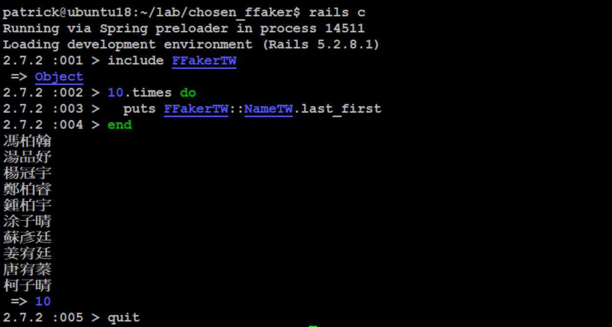

# FfakerTW 快速生成假資料 (繁體中文版)

* 修改自 [https://rubygems.org/gems/ffaker](https://rubygems.org/gems/ffaker)

```bash
gem install FfakerTW

rails c

10.times do
  puts FFakerTW::NameTW.name
end
```



還有
- FFakerTW::AddressTW.name (地址) => 有 name、city、city_town、taipei
- FFakerTW::AnimalTW.name (動物)
- FFakerTW::CompanyTW.name (公司)
- FFakerTW::EducationTW (學歷) => 有 name(校名)、degree(學位)
- FFakerTW::GenderTW.name (性別)
- FFakerTW::IdentificationTW.name (身份證號碼)
- FFakerTW::JobTW.name (職稱)
- FFakerTW::LoremTW (亂數假文) => 有 name(同word)、words、sentence、sentences、paragraph、paragraphs
- FFakerTW::NameTW (姓名) => 有 name、first_name、last_name、first_last
- FFakerTW::PhoneNumberTW (電話) => 有 name(隨機)、telphone、mobile
等等。
